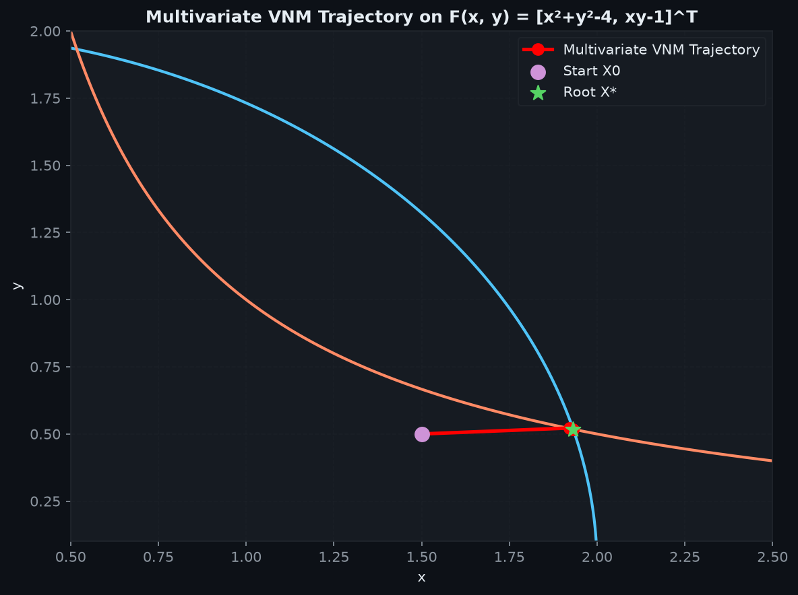

# A Variant of Newton's Method with Accelerated Third-Order Convergence

> **Course:** CSE 402 — Numerical Methods  
> **Repository Owner:** [Pulseparadigm](https://github.com/Pulseparadigm)  
> **Paper Authors:** S. Weerakoon and T. G. I. Fernando (Published in *Applied Mathematics Letters*, 13(8), pp. 87–93, 2000)

---

## 📌 Overview

This repository provides an implementation, theoretical extensions, and empirical benchmarking of the **Weerakoon-Fernando Variant of Newton's Method (VNM)** and its modern upgrades.

---

## 📋 Detailed Performance Comparison Report

| Method | Order ($p$) | Analytical $f'$ Needed? | Iterations to $10^{-15}$ | NFEV Efficiency |
|--------|------------|-------------------------|--------------------------|-----------------|
| **Newton–Raphson** | 2 | Yes | 5 – 10 | Baseline (2 eval/iter) |
| **Weerakoon–Fernando (VNM)** | **3** | Yes | 3 – 5 | High (3 eval/iter) |
| **Simpson–VNM Upgrade** | **4** | Yes | **2 – 4** | **Highest** (4 eval/iter) |
| **Steffensen–VNM Upgrade** | **3** | ❌ **No** | 3 – 5 | High (3-4 eval/iter) |
| **Multivariate VNM System** | **3** | Jacobian $J(X)$ | **3** | High (2 Jacobians/iter) |

---

## 📊 Comparison Graphs & Visualizations

### 1. Error Convergence Trajectories (Log Scale)


### 2. Efficiency Comparison (Iterations & Function Evaluations)


### 3. Empirical Order of Convergence (COC)


### 4. Multivariate 2D System Phase Trajectory


---

## 📁 Repository Structure

```text
CSE-402-Project/
├── README.md                           # Main repository overview & benchmark table
├── report.md                           # Detailed performance comparison report
├── walkthrough.md                      # Complete comparative report
├── implementation_plans.md             # Code specs & extension formulas
├── .gitignore                          # Git ignore configuration
├── src/
│   └── weerakoon_fernando.py           # Core implementation & benchmark suite
├── paper/
│   ├── A Variant of Newton’s Method...pdf  # Original research paper PDF
│   ├── extract_pdf.py                  # Text extraction script
│   └── paper_text.txt                  # Extracted text from PDF
└── plots/
    ├── convergence_comparison.png      # Error vs Iteration (Log scale)
    ├── efficiency_summary.png          # Iterations & Function Evaluations (NFEV)
    ├── coc_comparison.png              # Empirical Order of Convergence (COC)
    └── multivariate_trajectory.png     # 2D System phase trajectory
```

---

## 🚀 Getting Started

### Requirements
- Python 3.8+
- `numpy`
- `scipy`
- `matplotlib`

### Run Benchmark & Regenerate Plots
```bash
# Clone repository
git clone https://github.com/Pulseparadigm/CSE-402-Project.git
cd CSE-402-Project

# Run benchmark suite
python src/weerakoon_fernando.py
```

---

## 📝 References
- S. Weerakoon, T.G.I. Fernando, *"A Variant of Newton's Method with Accelerated Third-Order Convergence"*, Applied Mathematics Letters, Vol. 13, No. 8, pp. 87-93, 2000.
