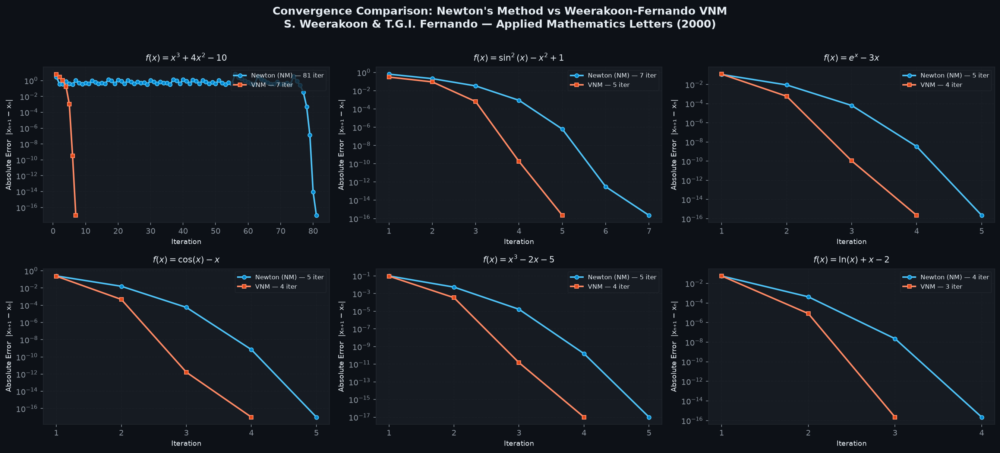
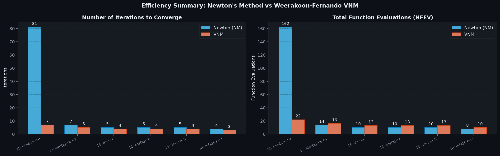
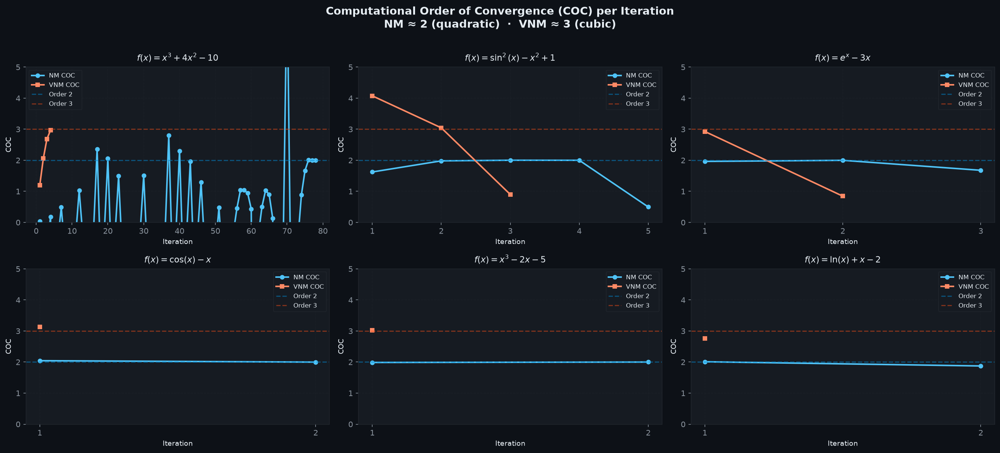

# A Variant of Newton's Method with Accelerated Third-Order Convergence

> **Course:** CSE 402 — Numerical Methods  
> **Repository Owner:** [Pulseparadigm](https://github.com/Pulseparadigm)  
> **Paper Authors:** S. Weerakoon and T. G. I. Fernando (Published in *Applied Mathematics Letters*, 13(8), pp. 87–93, 2000)

---

## 📌 Overview

This repository provides an implementation and empirical analysis of the **Weerakoon-Fernando Variant of Newton's Method (VNM)** for finding simple roots of non-linear equations $f(x) = 0$.

Unlike the classical Newton-Raphson method (which exhibits quadratic, 2nd-order convergence), the Weerakoon-Fernando variant achieves **cubic (3rd-order) convergence** by applying the trapezoidal quadrature rule to approximate the derivative integral in Newton's model. Crucially, **VNM does not require evaluating second or higher-order derivatives ($f''(x)$)**.

---

## 🧮 Theoretical Background

### Classical Newton-Raphson Method (Order 2)
$$x_{n+1} = x_n - \frac{f(x_n)}{f'(x_n)}$$

### Weerakoon-Fernando Method (Order 3)
Given an initial guess $x_n$:

1. **Predictor Step (Newton step):**
   $$y_n = x_n - \frac{f(x_n)}{f'(x_n)}$$

2. **Corrector Step (VNM update):**
   $$x_{n+1} = x_n - \frac{2 f(x_n)}{f'(x_n) + f'(y_n)}$$

---

## 📁 Repository Structure

```text
CSE-402-Project/
├── README.md                           # Main repository overview
├── walkthrough.md                      # Detailed technical report & analysis
├── .gitignore                          # Git ignore configuration
├── src/
│   └── weerakoon_fernando.py           # Python implementation & visualization benchmark
├── paper/
│   ├── A Variant of Newton’s Method...pdf  # Original research paper PDF
│   ├── extract_pdf.py                  # Text extraction script
│   └── paper_text.txt                  # Extracted text from PDF
└── plots/
    ├── convergence_comparison.png      # Error vs Iteration (Log scale)
    ├── efficiency_summary.png          # Iterations & Function Evaluations (NFEV)
    ├── root_paths.png                  # Visual root trajectories
    └── coc_comparison.png              # Computational Order of Convergence (COC)
```

---

## 📊 Experimental Results & Benchmarks

The implementation evaluates 6 non-linear equations, including test cases directly from **Table 1** of the paper:

| # | Function | Initial Guess ($x_0$) | Estimated Root |
|---|----------|------------------------|----------------|
| 1 | $f(x) = x^3 + 4x^2 - 10$ | $-0.5$ | `1.36523001341448` |
| 2 | $f(x) = \sin^2(x) - x^2 + 1$ | $1.0$ | `1.40449164821621` |
| 3 | $f(x) = e^x - 3x$ | $0.5$ | `0.619061286735945` |
| 4 | $f(x) = \cos(x) - x$ | $0.5$ | `0.739085133215161` |
| 5 | $f(x) = x^3 - 2x - 5$ | $2.0$ | `2.09455148154233` |
| 6 | $f(x) = \ln(x) + x - 2$ | $1.5$ | `1.55714852908987` |

### Key Plots

#### 1. Convergence Speed (Log Scale Error)


#### 2. Total Function Evaluations (NFEV) & Iteration Count


#### 3. Computational Order of Convergence (COC)


---

## 🚀 Getting Started

### Requirements
- Python 3.8+
- `numpy`
- `matplotlib`

### Installation & Execution
```bash
# Clone repository
git clone https://github.com/Pulseparadigm/CSE-402-Project.git
cd CSE-402-Project

# Install dependencies
pip install numpy matplotlib

# Run the benchmark & generate plots
python src/weerakoon_fernando.py
```

---

## 📝 License & References
- **Paper:** S. Weerakoon, T.G.I. Fernando, *"A Variant of Newton's Method with Accelerated Third-Order Convergence"*, Applied Mathematics Letters, Vol. 13, No. 8, pp. 87-93, 2000.
